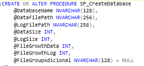
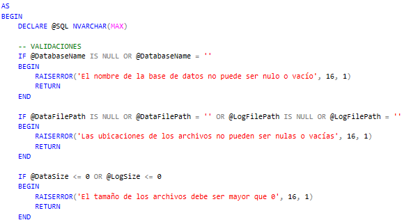
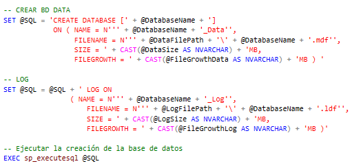
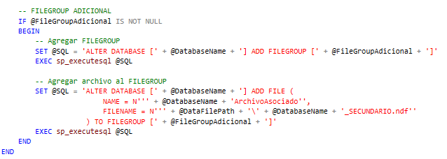

### Universidad Tecnológica de Tula-Tepeji.

#### Carrera: Ingeniería en Desarrollo y Gestión de Software.

#### Unidad de Aprendizaje: 1

#### Evaluación: 3

#### Alumno: Vania Donaji Velazquez Torres.

#### Matricula: 22300049

#### Grupo: 8 IDGS-G1

#### Periodo: Enero-Abril 2025.

#### Docente: Ing. Jose Luis Herrera Gallardo

# CREAR BASE DE DATOS DINÁMICAMENTE

### Procedimiento Almacenado
* Crear o alterar el Procedimiento Almacenado, le damos un nombre y declaramos las variables que se ocuparán para la creación de la base de datos y lo que implica.

* Después lo que se tiene es declarar otra variable @sql, esta variable almacena la consulta SQL dinámica que se va construyendo mediante concatenación de cadenas. Posteriormente, esta consulta se ejecuta con sp_executesql.
Hacemos las validaciones para que los campos que son obligatorios no vengan nulos o vacíos.

El siguiente paso es crear los archivos de Data y Log de nuestra base de datos, indicar el crecimiento de los archivos, donde se guardarán, el nombre y su crecimiento al alcanzar su tamaño máximo. 
Y ejecutamos la variable dinámica.

**NOTA:** Ejecutar la variable no quiere decir que se terminó el procedimiento almacenado, si no que se ejecutará lo que se lleve al momento, esto es para poder agregar y crear un nuevo FileGroup, ya que para agregar a la BD esta ya debe de estar creada.

* Por último, si es que el usuario agrego un nuevo FileGroup lo agregamos a la Base de Datos, para que este se vea reflejado debebos de agregarle un archivo, así que, también lo creamos y lo agregamos, en este caso lo estoy guardando en el mismo lugar que se guardo la Data. Y ejecutamos nuevamente nuestra variable de la consulta dinámica y terminamos el Procedimiento Almacenado.

**Nota:** Es importante primero crear la base de datos, antes de agregar el fileGroup, si no existirá un error, que a mi me sucedió y la solución es ejecutar la 
