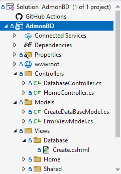

### Universidad Tecnológica de Tula-Tepeji.

#### Carrera: Ingeniería en Desarrollo y Gestión de Software.

#### Unidad de Aprendizaje: 1

#### Evaluación: 3

#### Alumno: Vania Donaji Velazquez Torres.

#### Matricula: 22300049

#### Grupo: 8 IDGS-G1

#### Periodo: Enero-Abril 2025.

#### Docente: Ing. Jose Luis Herrera Gallardo
---

# CREAR BASE DE DATOS DINÁMICAMENTE

## Procedimiento Almacenado
#### **Crear Store Procedure**
* Crear o alterar el Procedimiento Almacenado, le damos un nombre y declaramos las variables que se ocuparán para la creación de la base de datos y lo que implica. Después lo que se tiene que hacer es declarar otra variable @sql, esta variable almacena la consulta SQL dinámica que se va construyendo mediante concatenación de cadenas. 

```sql
CREATE OR ALTER PROCEDURE SP_CreateDatabase
    @DatabaseName NVARCHAR(128),
    @DataFilePath NVARCHAR(256),
    @LogFilePath NVARCHAR(256),
    @DataSize INT,
    @LogSize INT,
    @FileGrowthData INT,
    @FileGrowthLog INT,
    @FileGroupAdicional NVARCHAR(128) = NULL
AS
BEGIN
    DECLARE @SQL NVARCHAR(MAX)
```
#### **Validaciones en SQL***
* Posteriormente, esta consulta se ejecuta con sp_executesql.
Hacemos las validaciones para que los campos que son obligatorios no vengan nulos o vacíos.

```sql
-- VALIDACIONES
    IF @DatabaseName IS NULL OR @DatabaseName = ''
    BEGIN
        RAISERROR('El nombre de la base de datos no puede ser nulo o vacío', 16, 1)
        RETURN
    END

    IF @DataFilePath IS NULL OR @DataFilePath = '' OR @LogFilePath IS NULL OR @LogFilePath = ''
    BEGIN
        RAISERROR('Las ubicaciones de los archivos no pueden ser nulas o vacías', 16, 1)
        RETURN
    END

    IF @DataSize <= 0 OR @LogSize <= 0
    BEGIN
        RAISERROR('El tamaño de los archivos debe ser mayor que 0', 16, 1)
        RETURN
    END
```
#### **Crear los archivos de Data y Log**
* El siguiente paso es crear los archivos de Data y Log de nuestra base de datos, indicar el crecimiento de los archivos, donde se guardarán, el nombre y su crecimiento al alcanzar su tamaño máximo. 
Y ejecutamos la variable dinámica.

```sql
    -- CREAR BD DATA
    SET @SQL = 'CREATE DATABASE [' + @DatabaseName + '] 
                ON ( NAME = N''' + @DatabaseName + '_Data'', 
                     FILENAME = N''' + @DataFilePath + '\' + @DatabaseName + '.mdf'', 
                     SIZE = ' + CAST(@DataSize AS NVARCHAR) + 'MB, 
                     FILEGROWTH = ' + CAST(@FileGrowthData AS NVARCHAR) + 'MB ) '

    -- LOG
    SET @SQL = @SQL + ' LOG ON 
                    ( NAME = N''' + @DatabaseName + '_Log'', 
                        FILENAME = N''' + @LogFilePath + '\' + @DatabaseName + '.ldf'', 
                        SIZE = ' + CAST(@LogSize AS NVARCHAR) + 'MB, 
                        FILEGROWTH = ' + CAST(@FileGrowthLog AS NVARCHAR) + 'MB )'

    -- Ejecutar la creación de la base de datos
    EXEC sp_executesql @SQL
```

**📌 NOTA:** Ejecutar la variable no quiere decir que se terminó el procedimiento almacenado, si no que se ejecutará lo que se lleve al momento, esto es para poder agregar y crear un nuevo FileGroup, ya que para agregar a la BD esta ya debe de estar creada.

#### **Crear FileGroup (Opcional)**

* Por último, si es que el usuario agrego un nuevo FileGroup lo agregamos a la Base de Datos, para que este se vea reflejado debebos de agregarle un archivo, así que, también lo creamos y lo agregamos, en este caso lo estoy guardando en el mismo lugar que se guardo la Data. Y ejecutamos nuevamente nuestra variable de la consulta dinámica y terminamos el Procedimiento Almacenado.

```sql
    -- FILEGROUP ADICIONAL
    IF @FileGroupAdicional IS NOT NULL
    BEGIN
        -- Agregar FILEGROUP
        SET @SQL = 'ALTER DATABASE [' + @DatabaseName + '] ADD FILEGROUP [' + @FileGroupAdicional + ']'
        EXEC sp_executesql @SQL

        -- Agregar archivo al FILEGROUP
        SET @SQL = 'ALTER DATABASE [' + @DatabaseName + '] ADD FILE (
                        NAME = N''' + @DatabaseName + 'ArchivoAsociado'', 
                        FILENAME = N''' + @DataFilePath + '\' + @DatabaseName + '_SECUNDARIO.ndf''
                    ) TO FILEGROUP [' + @FileGroupAdicional + ']'
        EXEC sp_executesql @SQL
    END
END
```

**📌 Nota:** Es importante primero crear la base de datos, antes de agregar el fileGroup, si no existirá un error, que a mi me sucedió y la solución es ejecutar la variable por separado, para que se cree la bd antes de crear el filegroup.

---

# CRAECIÓN DE LA APLICACIÓN
## Aplicación con ASP.net usando MVC
#### **Crear Proyecto**
* Crear un proyecto usando ASP.net Core (MVC) en Visual Studio de preferencia. 


* Les asignamos un nombre y elegimos donde queremos que se guarde.

**📌 NOTA:** El patrón de diseño MVC, es Modelo, este es el que va relacionado a la BD, en este caso son las variables que nuestro procemiento almacenado esta esperando, Vista, esta es la interfaz Gráfica que se le hará llegar al usuario, donde se pedirán los valores de las variables y por último el Controlador, aquí aplicamos la lógica para cumplir con las operaciones necesarias, en este caso nos conectamos a sql, comenzamos el procedimiento, le mandamos los parametros y lo ejecutamos, en este caso estamos trabajando con Web, así que el controlador también nos ayuda a dirigir al usuario a la ruta que es, trabajamos con las cabeceras Post, Put, Get y Delete.

### **Creación de la Estructura de Carpetas**

* Creamos nuestra estructura de carpetas, esta es bastante importante más en la vista y controlador ya que son las que mandarán al usuario a la ruta correspondiente.



*Nos quedaría algo como esta en la imágen*

### **Definir el Modelo**

* Vamos al Modelo, que es lo principal.
Declaramos las variables necesarias que le pediremos al usuario y que nos pide el procedimiento almacenado que anteriormente ya creamos. Aquí mismo le agregamos validaciones a cada campo que se pide, en caso de es

```c#
using System.ComponentModel.DataAnnotations;

namespace AdmonBD.Models
{
    public class CreateDatabaseModel
    {
        [Required(ErrorMessage = "El nombre de la base de datos es obligatorio.")]
        public string DatabaseName { get; set; }


        [Required(ErrorMessage = "La ruta del archivo de datos es obligatoria.")]
        public string DataFilePath { get; set; }


        [Required(ErrorMessage = "La ruta del archivo de log es obligatoria.")]
        public string LogFilePath { get; set; }


        [Range(10, int.MaxValue, ErrorMessage = "El tamaño de los archivos debe ser al menos 10 MB.")]
        public int DataSize { get; set; }


        [Range(5, int.MaxValue, ErrorMessage = "El crecimiento de los archivos de data debe ser al menos 5%.")]
        public int DataFileGrowth { get; set; }


        [Range(10, int.MaxValue, ErrorMessage = "El tamaño del archivo de log debe ser al menos 10 MB.")]
        public int LogSize { get; set; }


        [Range(5, int.MaxValue, ErrorMessage = "El crecimiento de los archivos de log debe ser al menos 5%.")]
        public int LogFileGrowth { get; set; }


        public string? FileGroupAdicional { get; set; }


        public bool Created { get; set; }
    }
}
```
---
### **Vista**
#### **Modelo de la Vista**
```csharp
@model CreateDatabaseModel
```
- Define que la vista utiliza el modelo `CreateDatabaseModel`, el cual contiene los datos necesarios para la creación de la base de datos.  
- **⚠️ Importante:** Este modelo debe estar correctamente definido en el proyecto con las propiedades necesarias.

#### **Configuración del título de la página**
```csharp
@{
    ViewData["Title"] = "Crear Base de Datos";
}
```
- Establece el título de la página para que pueda ser utilizado en la plantilla general (`_Layout.cshtml`).


#### **Contenedor del formulario**
```html
<div class="container mt-4">
    <h2 class="mb-4">Crear Base de Datos</h2>
```
- Define un contenedor con un título para la interfaz del formulario.  

#### **Mensaje de éxito**
```csharp
@if (ViewBag.Message != null)
{
    <div class="alert alert-success mt-3">@ViewBag.Message</div>
}
```
- Si `ViewBag.Message` tiene contenido (por ejemplo, un mensaje de éxito tras crear la base de datos), lo muestra en un `div` con un mensaje de alerta.

#### **Inicio del formulario**
```html
<form asp-action="Create" method="post" class="needs-validation" novalidate>
``` 
- Define un formulario que envía los datos al método `Create` en el **`DatabaseController`** mediante `POST`.
- Usa `class="needs-validation"` y `novalidate`, que permite validación de Bootstrap sin activar la validación del navegador.


#### **Campos del formulario**
Cada campo usa `asp-for`, que vincula los inputs con las propiedades del modelo `CreateDatabaseModel`.  
Además, cada campo tiene validación con `asp-validation-for`, lo que muestra errores si los datos no cumplen con las reglas del modelo.

#### **Campos clave**  
```html
<label class="form-label">Nombre de la Base de Datos</label>
<input asp-for="DatabaseName" class="form-control" required />
<span asp-validation-for="DatabaseName" class="text-danger"></span>
```
- Permite ingresar el nombre de la base de datos.  
- **⚠️ Importante:** `required` hace que el campo sea obligatorio en el frontend.  

---
```html
<label class="form-label">Ubicación del Archivo de Datos</label>
<input asp-for="DataFilePath" class="form-control" required />
```
- Permite ingresar la ubicación donde se guardará el archivo `.mdf`.  

---
```html
<label class="form-label">Tamaño de Datos (MB)</label>
<input asp-for="DataSize" type="number" class="form-control" required min="10" />
```
  - Solo permite ingresar valores numéricos.  
  - `min="10"` obliga a que el tamaño mínimo sea **10 MB**.  

---
```html
<label class="form-label">FileGroup Secundario (Opcional)</label>
<input asp-for="FileGroupAdicional" class="form-control" />
```

  - Permite ingresar un grupo de archivos secundario.  
  - No es obligatorio (`Opcional`).  

---

#### **Botón de envío**
```html
<button type="submit" class="btn btn-primary">Crear</button>
```
- Envía el formulario para procesar la creación de la base de datos.   

 **Validación en backend y frontend:**  
   - El uso de `asp-validation-for` permite validar errores en el servidor.
   - El atributo `required` y `min` ayudan con la validación en el navegador.

 **Mensajes de éxito o error:**  
   - `ViewBag.Message` solo funciona si el formulario **no redirige** a otra vista.  
   - Si deseas mostrar un mensaje tras una redirección, usa `TempData["Message"]`.

---

### **Controlador**
#### **Dependencias**
* Agregamos las dependenacias necesarias para que funcione correctamente nuestro controlador.

```csharp
using AdmonBD.Models;
using Microsoft.AspNetCore.Mvc;
using Microsoft.Data.SqlClient;
using Microsoft.Extensions.Configuration;
using System.Threading.Tasks;
```

- **`using AdmonBD.Models;`**: Le decimos que haremos uso de nuestro modelo ya antes creado en la clase: `CreateDatabaseModel`.
- **`using Microsoft.AspNetCore.Mvc;`**: Importa las clases necesarias para trabajar con controladores y vistas en ASP.NET Core MVC.
- **`using Microsoft.Data.SqlClient;`**: Permite el uso de `SqlConnection`, `SqlCommand`, y otras clases necesarias para interactuar con la base de datos SQL Server.
- **`using Microsoft.Extensions.Configuration;`**: Permite acceder a la configuración de la aplicación, como las cadenas de conexión.
- **`using System.Threading.Tasks;`**: Importa las clases necesarias para trabajar con tareas asíncronas, lo cual es importante para no bloquear el hilo de ejecución.

#### **Clase `DatabaseController`**

```csharp
namespace AdmonBD.Controllers
{
    public class DatabaseController : Controller
    {
        private readonly IConfiguration _configuration;
        private readonly string _connectionString;

        public DatabaseController(IConfiguration configuration)
        {
            _configuration = configuration;
            _connectionString = configuration.GetConnectionString("DefaultConnection");
        }
```

- **`public class DatabaseController : Controller`**: Define un controlador MVC llamado `DatabaseController` que hereda de la clase base `Controller`. Los controladores manejan las solicitudes HTTP, procesan la lógica de negocio y devuelven respuestas.
- **`private readonly IConfiguration _configuration;`**: Se declara una variable privada que almacenará la configuración de la aplicación. `IConfiguration` es una interfaz que permite acceder a los valores de configuración (como las cadenas de conexión).
- **`private readonly string _connectionString;`**: Aquí se guarda la cadena de conexión a la base de datos. La cadena de conexión es esencial para establecer la comunicación con la base de datos.
- **`public DatabaseController(IConfiguration configuration)`**: Constructor que inyecta la configuración de la aplicación a través de la interfaz `IConfiguration`. Esto permite acceder a las configuraciones definidas en los archivos de configuración como `appsettings.json`.
- **`_connectionString = configuration.GetConnectionString("DefaultConnection");`**: Obtiene la cadena de conexión desde el archivo de configuración usando el nombre `"DefaultConnection"`.

#### **Acción HTTP GET - Crear Base de Datos (Formulario)**

```csharp
[HttpGet]
public IActionResult Create()
{
    return View("~/Views/DataBase/Create.cshtml");
}
```

- **`[HttpGet]`**: Este atributo indica que la acción manejará las solicitudes GET, es decir, cuando un usuario accede a la página para crear una base de datos.
- **`public IActionResult Create()`**: Esta acción devolverá la vista para crear una base de datos, que probablemente es un formulario donde el usuario ingresará los detalles.
- **`return View("~/Views/DataBase/Create.cshtml");`**: Especifica la vista que se debe renderizar, en este caso, el archivo `Create.cshtml` dentro de la carpeta `Views/DataBase`. Por eso anteriormente se mencionó que la estructura de carpetas es importente en este tipo de proyectos web.

#### **Acción HTTP POST - Procesar la Creación de la Base de Datos**

```csharp
[HttpPost]
public async Task<IActionResult> Create(CreateDatabaseModel model)
{
    try
    {
        // Validación de los parámetros necesarios
        if (string.IsNullOrEmpty(model.DatabaseName))
        {
            ViewBag.Message = "El nombre de la base de datos es obligatorio.";
            return View();
        }

        if (string.IsNullOrEmpty(model.DataFilePath))
        {
            ViewBag.Message = "La ruta del archivo de datos es obligatoria.";
            return View();
        }

        if (string.IsNullOrEmpty(model.LogFilePath))
        {
            ViewBag.Message = "La ruta del archivo de log es obligatoria.";
            return View();
        }
```

- **`[HttpPost]`**: Este atributo indica que la acción maneja las solicitudes POST, que generalmente se envían cuando el usuario envía un formulario.
- **`public async Task<IActionResult> Create(CreateDatabaseModel model)`**: La acción recibe un modelo (`CreateDatabaseModel`) que contiene los datos enviados desde el formulario. Es un método asincrónico, por lo que se usa `async` y `Task`.
- **`if (string.IsNullOrEmpty(model.DatabaseName))`**: Valida si el nombre de la base de datos está vacío. Si es así, muestra un mensaje de error.
- **`ViewBag.Message = "..."`**: `ViewBag` es un objeto que permite pasar datos desde el controlador a la vista. En este caso, se está pasando un mensaje que será mostrado al usuario si ocurre algún error.
- **`return View();`**: Si hay un error de validación, se retorna la vista nuevamente para que el usuario pueda corregir los datos.

#### **Conexión y Ejecución de Procedimiento Almacenado**

```csharp
// Ejecutar el procedimiento almacenado en la base de datos
using (var connection = new SqlConnection(_connectionString))
{
    await connection.OpenAsync();

    using (var command = new SqlCommand("SP_CreateDatabase", connection))
    {
        command.CommandType = System.Data.CommandType.StoredProcedure;

        command.Parameters.AddWithValue("@DatabaseName", model.DatabaseName);
        command.Parameters.AddWithValue("@DataFilePath", model.DataFilePath);
        command.Parameters.AddWithValue("@LogFilePath", model.LogFilePath);
        command.Parameters.AddWithValue("@DataSize", model.DataSize);
        command.Parameters.AddWithValue("@LogSize", model.LogSize);
        command.Parameters.AddWithValue("@FileGrowthData", model.DataFileGrowth);
        command.Parameters.AddWithValue("@FileGrowthLog", model.LogFileGrowth);

        if (string.IsNullOrEmpty(model.FileGroupAdicional))
        {
            command.Parameters.AddWithValue("@FileGroupAdicional", DBNull.Value);
        }
        else
        {
            command.Parameters.AddWithValue("@FileGroupAdicional", model.FileGroupAdicional);
        }

        await command.ExecuteNonQueryAsync();
    }
}
```

- **`using (var connection = new SqlConnection(_connectionString))`**: Establece una conexión a la base de datos usando la cadena de conexión obtenida previamente.
- **`await connection.OpenAsync();`**: Abre la conexión a la base de datos de manera asincrónica.
- **`using (var command = new SqlCommand("SP_CreateDatabase", connection))`**: Crea un objeto `SqlCommand` que ejecutará el procedimiento almacenado llamado `SP_CreateDatabase` en la base de datos.
- **`command.CommandType = System.Data.CommandType.StoredProcedure;`**: Especifica que el comando es un procedimiento almacenado, no una consulta SQL directa.
- **`command.Parameters.AddWithValue("...", model.Property);`**: Agrega parámetros al comando para que el procedimiento almacenado pueda utilizarlos. Cada uno de estos valores proviene del modelo recibido.
- **`await command.ExecuteNonQueryAsync();`**: Ejecuta el procedimiento almacenado de manera asincrónica. `ExecuteNonQueryAsync` se usa cuando no se espera un resultado, como es el caso al crear una base de datos.

#### **Manejo de Excepciones**

```csharp
catch (Exception ex)
{
    ViewBag.Message = $"Error al crear la base de datos: {ex.Message}";
    Console.WriteLine(ex);
}
```

- **`catch (Exception ex)`**: Si ocurre una excepción durante la ejecución del código en el bloque `try`, el flujo de ejecución se mueve aquí.
- **`ViewBag.Message = $"Error al crear la base de datos: {ex.Message}";`**: Muestra un mensaje de error en la vista.
- **`Console.WriteLine(ex);`**: Imprime la excepción en la consola, lo cual es útil para depurar, pero generalmente se debe evitar en producción.

#### **Respuesta Final**

```csharp
ViewBag.Message = "Base de datos creada correctamente.";
return View();
```

- **`ViewBag.Message = "Base de datos creada correctamente.";`**: Si el procedimiento almacenado se ejecuta con éxito, se informa al usuario que la base de datos se creó correctamente.
- **`return View();`**: Se retorna la vista nuevamente, mostrando el mensaje de éxito.

**📌 Notas Importantes:**

1. **Inyección de dependencias**: La clase `DatabaseController` utiliza la inyección de dependencias para obtener la configuración de la aplicación (`IConfiguration`), lo que es una buena práctica en ASP.NET Core para mantener el código limpio y modular.
2. **Procedimiento almacenado**: El código asume que ya existe un procedimiento almacenado llamado `SP_CreateDatabase` en la base de datos, lo que puede facilitar la gestión de la base de datos directamente desde SQL.
3. **Manejo de errores**: El bloque `try-catch` ayuda a capturar excepciones que puedan surgir durante la ejecución de la operación de base de datos y devuelve un mensaje adecuado al usuario.
4. **Asincronía**: El uso de `async` y `await` mejora el rendimiento de la aplicación al permitir que otras solicitudes se manejen mientras se espera la ejecución de las operaciones de base de datos.
5. **Middleware**: ASP.NET Core utiliza middleware para procesar las solicitudes HTTP, lo cual permite agregar funcionalidades como autenticación, autorización, manejo de excepciones y más, sin tener que modificar el código en el controlador.

**Y con esto tenemos nuestra aplicación web para la creacion de Bases de Datos en SQL Server.**

La Aplicación esta en la siguiente ruta:
'../../AppAdmonBD/AdmonBD'